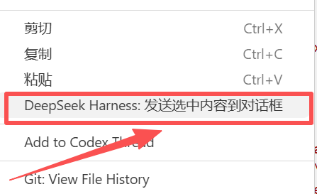
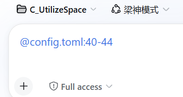

# DeepSeek Harness for VS Code

一个零依赖的 VS Code 扩展，把 **DeepSeek Harness (DSH)** 接入 VS Code 的两种形态：

1. **忠实窗口**：把 DSH 的 Web GUI 原样内嵌到 VS Code 侧边栏 / 辅助侧边栏 / 编辑器标签页，自动检测、启动 DSH 服务；
2. **Copilot 桥接（v0.7.13 起）**：把 DSH 注册为 VS Code 聊天模型——模型选择器里出现 **DSH (DeepSeek Harness)**，选中它提问，Copilot 组织好的现成对话经「滤除杂音」后交给 DSH + DeepSeek 模型二次组织解题，答案流式回写聊天框。**结合 Copilot 的对话组织优势与 DSH 的 agent 执行优势，让 DeepSeek 发挥最大性能。**

面板部分坚持「只做一个忠实的窗口」哲学：最大程度上客观、原样地呈现 DSH Web GUI，不注入脚本、不改写界面、不拦截交互，也不干涉你对 DSH 的插件开发、界面魔改等任何二次定制——DSH 的功能表达始终由你完全掌控。

如果喜欢本扩展请转至 [Deepseek-Harness-for-VS-Code](https://github.com/Vithrive/Deepseek-Harness-for-VS-Code) 星标助力；对 Chrome Extension 有需求也请关注 [Deepseek-Harness-for-Chrome](https://github.com/Vithrive/Deepseek-Harness-for-Chrome)。

## ✨ 快速上手：Copilot 桥接（v0.7.13 · 初始版本）

1. 安装本扩展（Marketplace 或 .vsix）→ Reload Window；
2. 打开 Chat 面板（Ctrl+Alt+I）→ 模型选择器（Ctrl+Alt+.）里选择 **DSH (DeepSeek Harness)**；
3. 直接提问，例如「帮我分析这个项目的数据」——DSH 用它配置的模型（默认跟随 DSH 设置；可用 dshPanel.chatProvider / dshPanel.chatModel 指定，如 deepseek-official / deepseek-v4-pro）在工作区执行工具解题，答案流式回写聊天框。

**工作原理（设计原则）**：吃 Copilot 组织好的现成对话 → 只滤杂音（系统提示词、工具定义、环境/上下文/记忆包装等 harness 内容全部丢弃；Copilot 记忆正文保留传递）→ 交给 DSH 用自己的 harness 二次组织。同一聊天对应同一 DSH 会话（续聊只发增量）；卸载扩展零残留。

**路线图**：这是一个初始版本，后续将更新：① DSH 模型的多模型选项（如 dsh-pro / dsh-flash 多个条目）；② 推理强度（reasoningEffort）选择。

> 详见下文「DSH 作为聊天模型（v0.7.13）」。备用入口：@dsh ChatParticipant（见「在 Copilot Chat 中使用 /dsh」）。

## 快速安装（下载 .vsix）

> 最简单的方式：在 VS Code 扩展市场搜索 **DeepSeek Harness for VSCode** 一键安装（[Marketplace 页面](https://marketplace.visualstudio.com/items?itemName=vithrive.deepseek-harness-vscode)）。

也可以从 GitHub 手动下载安装：

1. 从 [GitHub Releases](https://github.com/Vithrive/Deepseek-Harness-for-VS-Code/releases/latest) 下载最新的 `.vsix` 安装包：

   ```
   https://github.com/Vithrive/Deepseek-Harness-for-VS-Code/releases/latest/download/deepseek-harness-vscode-0.7.14.vsix
   ```

2. 在 VS Code 中安装：

   ```bash
   code --install-extension deepseek-harness-vscode-0.7.14.vsix
   ```

   或在 VS Code 中：`Ctrl+Shift+P` → `Extensions: Install from VSIX...` → 选择下载的 `.vsix` 文件。

3. 重载窗口：`Ctrl+Shift+P` → `Reload Window`。

4. 打开项目文件夹，点击 Activity Bar 的「DeepSeek Harness」图标，扩展会自动检测并启动 DSH。

## 特性

- **Copilot 桥接（v0.7.13）**：DSH 注册为 VS Code 聊天模型「DSH (DeepSeek Harness)」——在 Copilot Chat 模型选择器选中即可：吃 Copilot 组织好的现成对话、滤除杂音、交给 DSH 二次组织、流式回写（详见「快速上手：Copilot 桥接」）
- 在 Activity Bar 中新增「DeepSeek Harness」图标，点击后打开内嵌面板
- 支持把面板移动到**辅助侧边栏**（右键图标 → Move to Secondary Side Bar，或直接拖拽）
- **标签页模式**：通过「DeepSeek Harness: 在标签页中打开」（面板标题栏按钮或命令面板）在编辑器区域以标签页打开 DSH，页面宽度最大化，标签页可右键 **Pin 住**；标签页打开时侧边栏自动让位显示占位、关闭标签页后自动恢复（v0.3.5）
- **自动检测**：打开面板时探测 `dshPanel.url` 是否可访问
- **自动启动**：检测到未运行时，自动执行 `dsh web --host <host> --port <port>` 启动 DSH
- **工作区自动绑定**：启动 dsh 时使用 VS Code 当前打开的工作区文件夹作为 dsh 工作目录（无工作区则退回用户主目录）
- **工作区自动注册**：把 VS Code 当前工作区自动注册为 DSH 工作区，新会话默认使用该工作区（除非用户在 DSH 里手动切换）
- **远程（vscode-server）支持**：在 Remote-SSH / Dev Containers 等远程场景下运行，自动检测并安装服务器端的 dsh，并通过端口转发把 DSH 面板接入本地 VS Code
- **就绪等待**：启动后自动轮询等待服务就绪，再渲染界面，避免白屏
- **字号跟随编辑器**：面板整体等比缩放，从而让 16px 对话正文对齐 VS Code `editor.fontSize`（缩放比例 = `editor.fontSize` / 16，安全夹取到 8..72px / 0.5..2 倍），修改后即时生效，无需重载当前对话
- 面板顶部提供「刷新」「重启 dsh web」和「在浏览器中打开」按钮：「刷新」会重新加载内嵌的 DSH 页面（不影响 dsh web 服务与运行中的任务）；「重启」始终可启动/重启 dsh，仅当 dsh 非本窗口启动时会先弹确认，避免误中断其他窗口正在运行的任务
- **发送选中代码到 DSH**：选中代码后右键 → 「DeepSeek Harness: 发送选中内容到对话框」，自动插入到 DSH 对话框，支持精确光标定位（v0.2.12；v0.3.2 修复该功能不生效的问题，详见下方[使用示例](#使用示例发送选中内容到对话框)）
- **对话链接外部打开**：点击 DSH 对话中的外部链接会在系统默认浏览器打开，不在 iframe 内导航（v0.2.13，配合 DSH 插件 `dsh-open-links`）
- **自动安装 DSH 配套插件 `dsh-drop-caret`**（v0.3.0）：打开面板时自动检测并在 DSH 中安装配套插件，实现「把文件/文件夹/选中代码段插入 DSH 对话框」，用户只需安装本扩展
- **/dsh ChatParticipant（v0.4.2 起）**：在 VS Code Copilot Chat 中输入 `@dsh 你的问题`，自动把本对话中此前通过 @dsh 的问答上下文注入 DSH，由 DSH + 你配置的模型在工作区分析数据、执行工具解题，并把答案增量**流式回写**到 Copilot 聊天框；新开聊天会自动创建新的 DSH 会话（详见下文「在 Copilot Chat 中使用 /dsh」）

## 为什么自动安装 DSH 插件 `dsh-drop-caret`？

本扩展把 DeepSeek Harness (DSH) 的 Web GUI 内嵌在**跨域 iframe** 中。受浏览器同源安全策略限制，扩展（webview 是 iframe 的父容器）**无法直接操作 DSH 页面内部的输入框**——「把文件/文件夹/代码段插入对话框」这个动作必须由 DSH 页面内部的代码（一个 DSH 插件）来完成。

为了让你**只安装本扩展**就能获得完整能力，扩展会在每次打开面板时自动检查 DSH web profile，若缺少配套插件 `dsh-drop-caret` 则自动安装（优先 `dsh plugin --profile web add dsh-drop-caret`，失败时回退为 npm 拉取并写入 profile），并保持其版本满足要求。该插件实现以下功能：

- **拖放文件**：把文件拖进 DSH 对话框，在拖放点对应的精确光标位置插入路径引用（会话隔离存储，agent 可读）
- **拖放文件夹**：递归读取文件夹内所有文件并逐个插入引用
- **VS Code 资源管理器拖拽**：把 VS Code 侧边栏 Explorer 的文件/文件夹直接拖入对话框
- **发送选中代码段**：在编辑器选中代码 → 右键「DeepSeek Harness: 发送选中内容到对话框」→ 在对话框光标处插入 `路径:起始行-结束行`，模型可定位到该代码段
- **精确光标定位**：所有插入都发生在拖放点 / 当前光标处，而非简单的末尾追加

> 该插件由本扩展自动安装并保持更新，你无需（也不建议）手动在 DSH 里重复安装。

## 使用示例：发送选中内容到对话框

拖拽 / 右键发送是 `dsh-drop-caret` 最常用的能力，操作如下：

1. 在 VS Code 中**框选住代码块 / 文字块**；
2. **右键**，点击 **「DeepSeek Harness: 发送选中内容到对话框」**：

   

3. 该脚本对应代码块所在行数的链接（`路径:起始行-结束行`）就会被发送到对话框，插入在当前光标位置：

   

4. 在 DSH 里直接发送消息即可，模型可通过引用精确定位到代码块所在文件与行号。

> 同样地，也可以把文件 / 文件夹从系统文件管理器或 VS Code 资源管理器**直接拖进**对话框，插入位置同样是拖放点对应的光标位置。

## 在 Copilot Chat 中使用 /dsh（v0.4.0+）

在 VS Code **Copilot Chat** 中直接输入：

```
/dsh 帮我分析这个项目的数据，并给出结论
```

> 提示：`/dsh` 与 `@dsh` 均可调用；部分第三方聊天 provider 不渲染 `/` 参与者列表，此时请用 `@dsh 问题`。

扩展会自动：

1. 确保 DSH 服务就绪（复用面板的检测/自动启动逻辑）；
2. 为当前聊天创建（或复用）一个 DSH 会话：**新聊天自动新建 DSH 会话**，同一聊天内追问复用并携带此前 @dsh 的问答上下文（VS Code API 限制：参与者只能看到自己参与的消息，看不到其它模型的对话）；
3. 提交任务后轮询 DSH 的事件流，把答案**增量流式回写**到 Copilot 聊天框；执行进度（第几轮/第几步）以进度提示展示；
4. 完成/超时/出错都会给出明确提示；DSH 面板中可看到完整执行过程。

### 模型选择（如何让 DSH 用 DeepSeek v4 pro）

默认使用 **DSH 设置里的默认模型**（`agent-default-model`）。要固定为某个模型：

1. 先在 DSH 设置（或 `~/.dsh/settings.yaml`）里配置好对应 provider，例如 DeepSeek 官方 API：

   ```yaml
   llm-pi-ai:
     providers:
       deepseek:
         displayName: DeepSeek
         apiKeyEnv: DEEPSEEK_API_KEY
         api: openai-completions
         baseURL: https://api.deepseek.com/v1
         models:
           - id: deepseek-v4-pro
             name: DeepSeek v4 Pro
   ```

2. 在 VS Code 设置里指定（provider id 与模型 id 按你实际的配置填写）：

   ```json
   {
     "dshPanel.chatProvider": "deepseek",
     "dshPanel.chatModel": "deepseek-v4-pro"
   }
   ```

   留空则跟随 DSH 默认模型。

### 配置项

| 配置项 | 默认值 | 说明 |
|---|---|---|
| `dshPanel.chatAgentPreset` | 空 | `/dsh` 创建 DSH 会话时使用的 agent 预设（如 `liangshen`）；留空=DSH 默认 |
| `dshPanel.chatProvider` | 空 | 指定模型提供方（provider id）；留空=DSH 默认模型 |
| `dshPanel.chatModel` | 空 | 指定模型 id；与 `chatProvider` 配合 |
| `dshPanel.chatTimeoutMs` | 900000 | 单次 `/dsh` 任务最长等待毫秒数（15 分钟），超时后任务仍在 DSH 面板运行 |

### 其它

- **重置映射**：命令面板执行「DeepSeek Harness: 重置 /dsh 会话映射」，下次 `/dsh` 会创建全新 DSH 会话并重新携带 Copilot 历史。
- **诊断**：命令面板执行「DeepSeek Harness: 检查 /dsh 状态」，可查看 chat API 是否可用、参与者是否注册、DSH 是否可达、当前模型配置。
- **Copilot 消息代理（v0.5.0）**：扩展自带零依赖本地代理 `proxy/dsh-copilot-proxy.js`，截获 Copilot 发往自定义模型的完整消息列表，让 `/dsh` 能同步「上次 @dsh 之后切换到其它模型产生的中间对话」，实现 Copilot ↔ DSH 共享同一份消息列表（详见下文「共享消息列表（本地代理）」）。
- **取消**：停止等待不会杀掉 DSH 任务，任务会继续在 DSH 中运行，可到面板查看。
- **前置条件**：VS Code ≥ 1.94（自定义 Chat Agent 需 1.100+）、已安装 GitHub Copilot Chat；DSH 侧需要支持 RPC 端点 `session.create` / `session.selectModel` / `session.prompt` / `session.history`（实测 v0.1.0-rc.8 可用）。


## DSH 作为聊天模型（v0.7.13）

扩展把 DSH 注册为 VS Code 语言模型提供方（与 DeepSeek V4 等自定义模型同一机制）：模型选择器中会出现 **DSH (DeepSeek Harness)**。

- 选中它直接提问：VS Code 把组织好的完整对话（含它负责的 compact）交给扩展 → 过滤杂音（系统提示词/工具定义/环境信息）→ 交给 DSH（使用 `dshPanel.chatProvider`/`dshPanel.chatModel` 指定的模型，如 deepseek-official/deepseek-v4-pro）执行 → 流式回写聊天框。
- **无需磁盘扫描、无需代理、无需改任何配置**，卸载扩展零残留（模型随扩展消失）。
- 每次请求由 VS Code 自带全量上下文并负责 compact；DSH 用自己的工具（模型声明不支持 VS Code 工具，避免双 harness 冲突）。
- 与 `@dsh` 参与者、磁盘直读并存，互不影响；`dshPanel.enableDshModel=false` 可关闭。

## 共享消息列表（本地代理，v0.5.0）

VS Code Chat API 只给参与者看自己的消息，@dsh 看不到你切到自定义模型后产生的对话。本扩展内置一个零依赖本地代理，让两边拿到同一份消息列表：

```
VS Code Chat ──messages──▶ 本地代理(3050) ──转发──▶ api.deepseek.com
                              │
                              ├─ 记录完整 messages（/__dsh/recent 可读）
                              └─ 上游响应原样透传（含 SSE 流式）
```

### 两种同步来源（v0.6.0 起默认磁盘直读）

**磁盘直读（默认，零侵入）**：直接解析 VS Code 私有的 `chatSessions/*.jsonl` 会话文件（含空窗口），**不需要改任何模型配置**，卸载扩展零残留。用会话文件的 `sessionId` 标签精确映射 DSH 会话（新聊天必新建、同一聊天必复用），首次 `@dsh` 全量补课（取整个对话窗口的自定义模型问答），后续只增量同步中间对话。

**代理截获（可选，`dshPanel.chatSyncSource=proxy`）**：把模型 url 指向本地代理截获 messages。侵入式（卸载扩展前必须回退 url），仅当磁盘直读不可用时使用。

相关配置：`dshPanel.chatSyncSource`（disk/proxy）、`dshPanel.chatSyncLookbackMin`（默认 60 分钟扫描窗口）、`dshPanel.chatSyncInterim`、`dshPanel.chatSyncMaxChars`（默认 500000，软上限）。

之后：

- **Copilot → DSH**：@dsh 每次调用会从代理读取对话并注入 DSH 上下文：
  - **首次 @dsh**：一次性全量补课——取该对话窗口的完整消息列表（Copilot 每次全量重发，最新一条记录即整个对话），超 `dshPanel.chatSyncMaxChars` 时先压缩但绝不截断；
  - **后续 @dsh**：只增量同步「上次 @dsh 之后产生的中间对话」（按上次提问定位）。
  - **内容清洗**：只传输有效对话——自动跳过 VS Code 系统提示词（`<instructions>/<skills>/<description>`）、环境信息块（`<environment_info>` 等）、`<context>/<reminderInstructions>` 注入块、工具输出与标题生成请求；用户提问只保留 `<userRequest>` 内的真实内容。
- **DSH → Copilot**：@dsh 的回答本来就在聊天记录里，切回自定义模型时 VS Code 会整段发给模型（天然共享）。
- 代理由扩展自动启动/复用；命令面板「DeepSeek Harness: 停止 Copilot 消息代理」可手动停止。

### 相关配置

| 配置项 | 默认值 | 说明 |
|---|---|---|
| `dshPanel.chatProxyUrl` | http://127.0.0.1:3050 | 代理地址 |
| `dshPanel.chatProxyUpstream` | https://api.deepseek.com | 代理默认转发的上游（多模型按 `proxy/routes.json` 的模型→上游表路由） |
| `dshPanel.chatProxyAutoStart` | true | 未运行时自动启动 |
| `dshPanel.chatSyncInterim` | true | 是否同步中间对话 |
| `dshPanel.chatSyncMaxChars` | 500000 | 单次同步最大字符数（软上限：超限先压缩、不截断） |

### 注意事项

- **代理不可用时，Copilot 中指向代理的 DeepSeek 模型会不可用**；想完全回退，把 `chatLanguageModels.json` 的 url 改回原地址即可（备份文件）。
- 若 VS Code 拒绝 `http://` 自定义端点：代理支持 HTTPS（自带自签名证书，需先信任），把 url 改为 `https://127.0.0.1:3051/v1` 并把 `dshPanel.chatProxyUrl` 相应改为 `https://127.0.0.1:3051`，同时给扩展的代理启动加 `--https-port 3051`（可联系作者或自行配置 `dshPanel.dshCommand` 旁路脚本）。
- 中间对话同步是 best-effort：定位不到当前聊天时宁缺毋滥，不会注入错误上下文。


## 从源码安装（开发模式，零依赖，无需编译）

本扩展是纯 JavaScript，**不需要 npm install、不需要 TypeScript 编译**。

### 方式一：直接加载开发扩展

1. 克隆并打开本目录：

   ```bash
   git clone https://github.com/Vithrive/Deepseek-Harness-for-VS-Code.git
   code Deepseek-Harness-for-VS-Code
   ```

2. 在 VS Code 中按 `F5`，会弹出「扩展开发宿主」窗口。

3. 在扩展开发宿主中打开你的项目文件夹（File → Open Folder），这样 DSH 的工作区就是你的项目。

4. 点击左侧 Activity Bar 的「DeepSeek Harness」图标，面板会：
   - 检测 `http://127.0.0.1:3080` 是否已运行；
   - 若未运行，自动执行 `dsh web --host 127.0.0.1 --port 3080`，工作目录为当前项目；
   - 服务就绪后自动渲染 DSH 界面。

5. 把图标移到辅助侧边栏：右键图标 → **Move to Secondary Side Bar**。

### 方式二：自行打包成 .vsix 并安装

```bash
cd DeepSeek-Harness-for-VS-Code
npx --yes @vscode/vsce package --allow-missing-repository
code --install-extension deepseek-harness-vscode-0.7.14.vsix
```

## 配置

在 VS Code 设置（`settings.json`）中可覆盖默认值：

```json
{
  "dshPanel.url": "http://127.0.0.1:3080",
  "dshPanel.host": "127.0.0.1",
  "dshPanel.port": 3080,
  "dshPanel.autoStart": true,
  "dshPanel.autoRegisterWorkspace": true,
  "dshPanel.autoInstallDsh": true,
  "dshPanel.dshCommand": "dsh",
  "dshPanel.killOnDispose": true
}
```

### 各配置项含义

| 配置项 | 默认值 | 说明 |
|---|---|---|
| `dshPanel.url` | `http://127.0.0.1:3080` | 面板连接的 DSH 地址 |
| `dshPanel.host` | `127.0.0.1` | 自动启动时绑定的主机 |
| `dshPanel.port` | `3080` | 自动启动时监听的端口 |
| `dshPanel.autoStart` | `true` | 未运行时是否自动启动 dsh |
| `dshPanel.autoRegisterWorkspace` | `true` | 是否把 VS Code 当前工作区自动注册为 DSH 工作区 |
| `dshPanel.autoInstallDsh` | `true` | 未安装 dsh 时是否提示并代为安装 |
| `dshPanel.dshCommand` | `dsh` | dsh 命令（可填完整路径） |
| `dshPanel.killOnDispose` | `true` | 扩展停用时是否结束它启动的 dsh |

### 远程服务器（vscode-server）场景

本扩展声明 `extensionKind: ["workspace"]`，在 Remote-SSH / Dev Containers 等远程场景下运行于服务器端，因此：

1. **自动检测并安装 dsh**：打开面板时，会在服务器端执行 `dsh --version` 检测是否已安装 DeepSeek Harness。未安装时弹出提示，确认后自动执行 `npm install -g @deepseek-ai/dsh`（要求服务器已安装 Node.js 与 npm）。

2. **自动端口转发**：DSH 在服务器上监听 `127.0.0.1:3080`。扩展通过 `vscode.env.asExternalUri` 自动建立端口转发，把远程端口暴露到本地，使侧边栏中的 iframe 能直接加载远程 DSH 界面，无需手动配置 SSH 隧道。

3. **工作区自动对接**：dsh 以远程工作区为 `cwd` 启动，新会话默认使用该远程工作区，并自动注册到 DSH 工作区列表。

> 注意：VS Code 首次转发端口可能弹出「是否转发端口」的确认，选择允许即可。

### 手动 SSH 隧道（可选，非远程场景）

如果你的 DSH 跑在另一台机器、且不是通过 VS Code Remote 连接的，可手动建立 SSH 隧道：

```bash
ssh -L 3080:127.0.0.1:3080 user@your-server
```

然后把 `dshPanel.autoStart` 设为 `false`（避免在本地又起一个），`dshPanel.url` 保持 `http://127.0.0.1:3080`。

## 工作原理

1. 打开面板 → 先显示「正在启动」加载页；
2. 用 Node 内置 `http`/`https` 探测 `dshPanel.url`；
3. 未连接且 `autoStart` 开启 → `spawn('dsh web --host ... --port ...')`，`cwd` 设为 VS Code 工作区；
4. 轮询等待服务就绪（最多约 30 秒）；
5. 服务就绪后，通过 `POST /api/workspace.create` 把 VS Code 当前工作区注册为 DSH 工作区；
6. 就绪后通过 `WebviewViewProvider` 渲染 iframe；
7. `retainContextWhenHidden: true` 保持面板隐藏时不丢会话状态；
8. 扩展停用时按 `killOnDispose` 决定是否结束它自己启动的 dsh（不影响你手动启动的实例）。

## 工作区行为说明

- **新会话默认工作区**：DSH 的新会话默认使用 `dsh` 进程的启动目录（`cwd`）作为工作区。扩展以 VS Code 当前工作区作为 `cwd` 启动 dsh，因此新会话默认指向 VS Code 工作区。
- **工作区列表注册**：扩展会在服务就绪后调用 `workspace.create`，把 VS Code 工作区加入 DSH 的工作区列表（幂等，已存在则不重复）。
- **用户可手动更改**：在 DSH 里手动选择其他工作区后，新会话会按你选择的工作区创建，扩展不会覆盖你的选择。

## 分支说明

- `dev-<版本号>`：开发分支，命名与扩展版本号一致（历史 `dev-0.1.0`，当前 `dev-0.7.14`）
- `main`：与最新 `dev-*` 内容保持一致，作为默认分支
- `.vsix` 安装包通过 [GitHub Releases](https://github.com/Vithrive/Deepseek-Harness-for-VS-Code/releases) 发布

## 前置条件

- 已安装 DeepSeek Harness：支持 `npm install -g @deepseek-ai/dsh` 全局安装，也支持 `npx @deepseek-ai/dsh` 安装（包只缓存在 npx 目录、不写全局 PATH 也能识别）；扩展会自动检测这两种方式，也可通过 `dshPanel.dshCommand` 指定完整路径
- 实测 DSH 默认响应头未设置 `X-Frame-Options` / 严格 `CSP`，可被 iframe 正常内嵌

## 已知限制

**标签页与侧边栏暂不能同时加载 DSH**：当 DSH 被 VS Code 的多个 webview（侧边栏 + 编辑器标签页）同时加载时，后加载的一个会卡在「loading plugins」。

原因：DSH 前端在 VS Code 的 webview 多实例场景下退化为单例——而普通浏览器多开 tab 是正常的，其它同类扩展（如 Kimi Code）双 webview 同开也正常，说明这是 DSH 前端实现层面的问题，并非 VS Code 环境限制（详见 [DSH 团队 discussions](https://github.com/deepseek-ai/deepseek-harness/discussions) 反馈）。

本扩展采用「单活动视图」策略规避：打开标签页时侧边栏自动让位显示占位，关闭标签页后侧边栏自动恢复。要实现真正的并存，需要 DSH 前端支持 webview 多实例。
