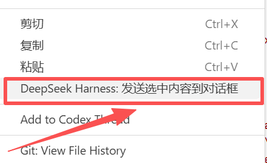
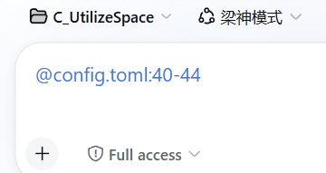

# DeepSeek Harness for VS Code

一个零依赖的 VS Code 扩展，把 **DeepSeek Harness (DSH)** 接入 VS Code 的两种形态：

1. **忠实窗口**：把 DSH 的 Web GUI 原样内嵌到 VS Code 侧边栏 / 辅助侧边栏 / 编辑器标签页，自动检测、启动 DSH 服务——不注入脚本、不改写界面、不拦截交互，不影响你对 DSH 的页面组织、第三方插件装配等任何二次开发行为；
2. **Copilot 桥接（v0.7.13 起）**：把 DSH 注册为 VS Code 聊天模型——模型选择器里出现 **DeepSeek Harness 下属模型** 条目（`DSH (DeepSeek Harness)` 跟随 DSH 设置里的默认模型，其余条目固定对应 DeepSeek 官方现役模型，条目名随 DeepSeek 模型版本更新），选中即可在 Copilot Chat 里借助 DSH 强大的任务编排与工具调用能力解题。

> **Copilot 桥接不影响「忠实窗口」形态**——它只是为便捷编程而做的功能提升；你不选这些模型条目时，一切与没有桥接功能时完全一样。

如果喜欢本扩展请转至 [Deepseek-Harness-for-VS-Code](https://github.com/Vithrive/Deepseek-Harness-for-VS-Code) 星标助力；对 Chrome Extension 有需求也请关注 [Deepseek-Harness-for-Chrome](https://github.com/Vithrive/Deepseek-Harness-for-Chrome)。

> **版本适配**：本扩展 **v0.8.34 起**适配 **dsh v0.1.2-rc.1 及以上版本**——自动完成该版本起新增的 Web 浏览器认证（扩展受管认证代理，面板与 Copilot 桥接全程免登录、免打扰，详见下文「dsh web 浏览器认证」）；同时**向下兼容**未启用认证的旧版 dsh（启动参数探测、RPC 端点新旧格式自动回退）。**1.0.0 起**同步适配 **dsh 0.2.x** 的回答事件通道（`assistant/message`，旧的 `assistant/chunk` 仍兼容），并跟随 DeepSeek 现役模型（`deepseek-flash` = V4.1-Flash、`deepseek-v4-pro`）。

## 🙏 致谢

- [Pelapis](https://github.com/Pelapis)——贡献 macOS 面板剪贴板快捷键修复并迭代收敛作用域（内置插件 `dsh-webview-clipboard`，PR #11、#14）。
- [curtainsmall](https://github.com/curtainsmall)——修复面板 iframe 非整数倍缩放的整页模糊（改用 CSS zoom，PR #10）。
- [anupamme](https://github.com/anupamme)——报告工作区设置注入面，推动子进程调用安全加固（PR #12）。

---

## 🚀 快速安装

- **Marketplace**：在 VS Code 扩展市场搜索 **DeepSeek Harness for VSCode** 一键安装（[Marketplace 页面](https://marketplace.visualstudio.com/items?itemName=vithrive.deepseek-harness-vscode)）。
- **.vsix**：从 [GitHub Releases](https://github.com/Vithrive/Deepseek-Harness-for-VS-Code/releases/latest) 下载 `deepseek-harness-vscode-<版本>.vsix`，然后：

  ```bash
  code --install-extension deepseek-harness-vscode-<版本>.vsix
  ```

  或在 VS Code 中：`Ctrl+Shift+P` → `Extensions: Install from VSIX...`。

安装后 `Ctrl+Shift+P` → `Reload Window`。打开面板时扩展会自动检测并启动 DSH（未安装会提示并代为执行 `npm install -g @deepseek-ai/dsh`）。

---

## 🪟 忠实窗口（面板）

- 把 DSH Web GUI 原样内嵌到侧边栏 / 辅助侧边栏 / **编辑器标签页**（标签页可 Pin 住；与侧边栏「单活动视图」自动让位，规避 DSH 前端 webview 单实例限制）；
- **自动检测 / 自动启动 / 自动安装** dsh，服务就绪后再渲染，避免白屏；
- **工作区自动对接**：以 VS Code 当前工作区启动 dsh 并注册到 DSH 工作区列表（幂等，不覆盖你在 DSH 里的手动选择）；
- **远程支持**：Remote-SSH / Dev Containers 下运行于服务器端，自动检测安装服务器端 dsh、经端口转发把面板接入本地 VS Code；
- 面板按钮：刷新（不打断运行中的任务）/ 重启 dsh web / 在浏览器中打开；字号跟随 `editor.fontSize` 等比缩放（CSS zoom 实现，非整数倍缩放同样清晰）；
- **发送选中内容 / 拖放文件到 DSH 对话框**（自动安装配套插件 `dsh-drop-caret`）：把文件、文件夹、代码段以 `路径:行号` 引用精确插入对话框光标处——**从 VS Code 资源管理器拖拽直接引用源文件本身**（不产生副本）；从系统文件管理器拖入时浏览器无法取得真实路径，此时才回退为工作区 `.dsh-drop/` 下的内容快照。点击 DSH 对话中的外链在系统浏览器打开（配合 DSH 插件 `dsh-open-links`）。
- **macOS 剪贴板快捷键修复（自动安装配套插件 `dsh-webview-clipboard`）**：修复 macOS 上面板内 ⌘C/⌘V/⌘X 失效的问题——DSH 页面以跨源 iframe 内嵌于 webview 时，浏览器的原生剪贴板默认动作不会发生。插件注入 DSH 页面后拦截这三个键并经 execCommand 显式执行。仅 macOS + 被内嵌时启用，其余环境行为不变。
- **点击对话里的工作区文件/文件夹链接 → 在 VS Code 资源管理器中定位并打开（自动安装配套插件 `dsh-vscode-file-links`，v0.8.46 起）**：模型回答里的 `src/a.ts`、`docs/` 这类工作区相对路径链接，原本点击后会在 DSH 侧边栏打开；现在在面板内点击会改为在本窗口的**资源管理器**中定位并打开（文件同时打开编辑器，文件夹仅定位）。**前提**：目标必须位于当前 VS Code 打开的工作区内且真实存在——不满足时自动回落到原来的 DSH 侧边栏行为，绝不出现「点了没反应」。详见下文专节。

### 使用示例：发送选中内容到对话框

拖拽 / 右键发送是 `dsh-drop-caret` 最常用的能力，操作如下：

1. 在 VS Code 中**框选住代码块 / 文字块**；
2. **右键**，点击 **「DeepSeek Harness: 发送选中内容到对话框」**：

   
3. 代码块所在行数的链接（`路径:起始行-结束行`）就会被发送到对话框，插入在当前光标位置：

   
4. 在 DSH 里直接发送消息即可，模型可通过引用精确定位到代码块所在文件与行号。

> 同样地，也可以把文件 / 文件夹从系统文件管理器或 VS Code 资源管理器**直接拖进**对话框，插入位置同样是拖放点对应的光标位置。

### 面板相关配置

| 配置项 | 默认值 | 说明 |
| --- | --- | --- |
| `dshPanel.url` | `http://127.0.0.1:3080` | 面板连接的 DSH 地址 |
| `dshPanel.host` / `dshPanel.port` | `127.0.0.1` / `3080` | 自动启动时绑定的主机与端口 |
| `dshPanel.autoStart` | `true` | 未运行时是否自动启动 dsh |
| `dshPanel.autoRegisterWorkspace` | `true` | 是否把当前工作区自动注册为 DSH 工作区 |
| `dshPanel.autoInstallDsh` | `true` | 未安装 dsh 时是否提示并代为安装 |
| `dshPanel.dshCommand` | `dsh` | dsh 命令（可填完整路径） |
| `dshPanel.killOnDispose` | `true` | 扩展停用时是否结束它启动的 dsh |
| `dshPanel.openSystemBrowser` | `false` | 扩展启动 dsh 时是否保留弹系统浏览器的旧行为 |
| `dshPanel.installClipboardPlugin` | `true` | 自动安装内置 `dsh-webview-clipboard` 插件（修复 macOS 面板内编辑快捷键；Windows/Linux 上为惰性文件不影响行为）。怀疑影响 dsh web 启动时可关闭对比 |
| `dshPanel.workspaceFileLinkAction` | `revealAndOpen` | 对话里工作区文件/文件夹链接的点击行为：`revealAndOpen` 资源管理器定位并打开 / `revealOnly` 仅定位 / `off` 不接管（保持 DSH 侧边栏打开，也不安装配套插件） |

### 点击对话里的文件/文件夹链接 → 在 VS Code 资源管理器中定位（v0.8.46 起）

模型回答里的工作区路径链接（指向 `src/a.ts`、`docs/` 这类路径的 Markdown 链接）在 DSH 里是
可点击的：DSH 会把它们打开在自己的右侧边栏。本扩展在面板内把这一点击改接到 VS Code：

| 场景 | 行为 |
| --- | --- |
| 目标在当前 VS Code 工作区内且存在 | 资源管理器中定位并选中；文件同时用**非预览标签页**打开编辑器（文件夹只定位） |
| 目标不在工作区内（或不存在） | 自动回落到 DSH 自身行为：在 DSH 侧边栏打开，并在状态栏提示「不在当前 VS Code 工作区内」 |
| 按住 `Ctrl`/`Cmd`/`Shift`/`Alt` 再点击 | 始终走 DSH 侧边栏（临时绕过接管） |
| 在系统浏览器里打开 DSH（非面板内） | 完全不介入，行为与以前一致 |
| `dshPanel.workspaceFileLinkAction` = `off` | 完全不接管，行为与以前一致 |

实现方式与「忠实窗口」原则的边界：

- 由内置插件 `dsh-vscode-file-links` 在 DSH 页面内**只监听**「文件链接按钮」的点击
  （DSH 的 `MarkdownFileLink` 按钮，`title` 就是链接目标路径），其余 DOM 一律不碰；
- 点击路径经 `postMessage` 逐级转发：DSH 页面 → webview → 扩展宿主；扩展宿主解析路径
  （相对路径对每个工作区文件夹依次尝试，绝对路径与 `../` 越界一律拒绝）并执行
  `revealInExplorer` / `vscode.open`，再把结果回执原路返回；
- 插件只在收到面板握手回执（`ack`）后才接管；`off` 时面板不给回执，插件保持惰性；
- 首次安装/升级该插件后，需点击面板顶部「重启 dsh web」使其加载（扩展会提示）；
- 已知限制：DSH 的链接行号（如 `src/a.ts#L12`）不参与定位，打开的编辑器停在第 1 行。

### dsh web 浏览器认证（v0.8.35 起，自动完成，无需任何操作）

dsh `0.1.2-rc` 起为 Web GUI 启用了浏览器认证：每次 `dsh web` 启动会生成一个一次性「进程启动令牌」并打印形如 `dsh web: http://127.0.0.1:3080/?token=…` 的认证链接，浏览器打开该链接后换取签名 Cookie，此后凭 Cookie 访问；裸地址一律返回 401。同时 `/api` 还有浏览器信任围栏（Host 必须回环、Origin 与 Host 一致、拒绝跨站请求）。

扩展的处理方式（**不关闭 dsh 的任何安全机制，全程无感**）：

- 由扩展启动 dsh 时，自动捕获其 stdout 打印的认证链接，并在本机 `127.0.0.1` 随机端口启动一个**受管认证代理**：由代理完成令牌 → Cookie 换发，之后给每个转发请求（页面、API、WebSocket）注入凭据，面板与 Copilot 桥接全部改走代理；
- 令牌会缓存到 VS Code 全局状态：其他窗口 / 重载 VS Code 后，只要 dsh 实例没变，依然静默认证；
- 启动 dsh 时默认附加 `--no-open`，不再弹出系统浏览器（需要旧行为时打开 `dshPanel.openSystemBrowser`）；
- 如果 dsh 是**在本扩展之外启动**的（拿不到它的令牌），首次打开面板会提示一次，二选一：「重启并自动认证（推荐）」由扩展接管 dsh，此后恢复完全静默；或把终端里 `dsh web:` 打印的认证链接整行粘贴进来；
- 「在浏览器中打开」按钮会自动携带当前令牌，系统浏览器可正常换取自己的 Cookie；
- Remote / 非回环地址场景不启用代理（认证须在 dsh 所在机器的浏览器完成一次），行为与旧版一致。

### 对旧版本 dsh 的兼容（无认证版本）

扩展对未启用 web 认证的旧版 dsh 保持完整兼容，回退路径全部自动、无感：

- **启动参数**：`--no-open` 先经 `dsh web --help` 探测，老版本不支持就不传（不会因未知参数导致启动失败）；
- **认证链路**：面板加载前会探测首页状态——旧版返回 200（无认证）即走原直连路径，不启用代理注入；「重启并自动认证」等引导也只在探测到 401 时出现；
- **RPC 端点**：扩展按新版斜杠端点（`workspace/create` 等）请求，收到 404 自动回退旧点号端点（`workspace.create`）；`session/page` 不可用时回退 `session.history`；
- **完全启动等待**：以「`dsh web:` 打印行」为就绪信号（新旧版本都会打印）；个别从不打印的极老版本会被记忆（`dsh.quietBoot`），之后不再等待。

### 远程服务器（vscode-server）场景

扩展声明 `extensionKind: ["workspace"]`，在 Remote-SSH / Dev Containers 等场景下运行于服务器端：

1. 自动检测并安装服务器端的 dsh（`npm install -g @deepseek-ai/dsh`，要求服务器已装 Node.js 与 npm）；
2. 自动端口转发：通过 `vscode.env.asExternalUri` 把远程 `127.0.0.1:3080` 暴露到本地，iframe 直接加载，无需手动配 SSH 隧道（首次转发确认允许即可）；
3. dsh 以远程工作区为 cwd 启动并自动注册。

如果 DSH 跑在另一台机器、且不是通过 VS Code Remote 连接的，可手动建隧道：`ssh -L 3080:127.0.0.1:3080 user@server`，并把 `dshPanel.autoStart` 设为 `false`。

---

## 🧭 Copilot 桥接：操作指南

### 快速上手

1. 打开 Chat 面板（`Ctrl+Alt+I`）→ 模型选择器（`Ctrl+Alt+.`）里选择 **DeepSeek Harness 下属模型**（`DSH (DeepSeek Harness)`，或任一固定的 DeepSeek 官方模型条目）；
2. 直接提问，例如「帮我分析这个项目的数据」——DSH 用其配置的模型在工作区执行任务、调用工具解题，答案**流式回写**聊天框；
3. 每个 Copilot 聊天对应一个 DSH 会话：**新聊天自动新建 DSH 会话，同一聊天内持续追问复用同一会话**；你可以在 DSH 面板里实时看到完整执行过程。

### 模型与推理档位

- **模型**：`DSH (DeepSeek Harness)` 条目默认跟随 DSH 设置里的默认模型（`agent-default-model`）；也可用 `dshPanel.chatProvider` / `dshPanel.chatModel` 指定（如 `deepseek-official` / `deepseek-flash`，需先在 DSH 设置中配置好对应 provider）。其余条目是 **DeepSeek Harness 下属模型**里的固定项——固定对应 DeepSeek 官方**现役**模型，条目名随 DeepSeek 模型更新（当前映射见下表）。
- **推理档位（reasoningEffort）**：在聊天界面的模型配置里选择（off / low / high / max，与 DSH 会话同步生效）；`dshPanel.dshReasoningEffort` 作为兜底配置。

#### 与 DeepSeek 现役模型的对应关系（1.0.0）

DeepSeek 于 2026-09-10 发布 **DeepSeek-V4.1-Flash**（原生多模态），并把旧的 V4 Flash、V4 Flash Vision Exp 两个模型**退役**为兼容路由（旧模型名仍可用，请求由 V4.1-Flash 承接、按 Flash 计价）——因此模型选择器里只保留现役条目（当前 DeepSeek Harness 下属模型）：

| VS Code 模型条目 | DSH 侧模型 id | 说明 |
| --- | --- | --- |
| `DSH (DeepSeek Harness)` | 跟随 DSH 设置 | 当前 DSH 默认即 `deepseek-flash`（V4.1-Flash） |
| `DeepSeek-V4.1-Flash (DSH)` | `deepseek-flash` | 1M 上下文、原生多模态（桥接目前只转发文本） |
| `DeepSeek-V4-Pro (DSH)` | `deepseek-v4-pro` | DeepSeek-V4-Pro-0813 |

> DSH 的 `session.selectModel` 会校验模型是否登记在 `llm-deepseek` 配置里，未登记的 id 会报 `session/model-unavailable` 并被扩展**静默**回落成 DSH 默认模型——所以映射用的是「DSH 侧真实模型 id」而非 DeepSeek API 的兼容旧名。v0.8.48 起每次会话首次提问还会做一次漂移自检（读 DSH 的 `session/modelCatalog`），映射失配时直接弹告警而不是继续静默。
>
> 条目名与映射随 DeepSeek 模型更新：0.8.47 及更早的 `DeepSeek-V4-Flash (DSH)` / `deepseek-v4-flash-vision-exp (DSH)` 条目已移除，若旧会话/设置里仍留存这些条目 id，扩展仍会把它们解析到 `deepseek-flash`。发现下拉框里的名字与实际模型不符时，通常意味着需要升级本扩展。

### 切换模型再切回

Copilot 会话中途切到其他自定义模型问答、再切回 DSH 模型时，扩展会把「其他模型产出的中间对话」**打上产地标签补发给 DSH 会话**；DSH 自己答过的内容不会重复回传（省 token、不占上下文）——DSH 侧时间线保持完整。

### 常用命令

| 命令 | 作用 |
| --- | --- |
| `DeepSeek Harness: 重置 DSH 会话映射` | 清空「聊天 → DSH 会话」映射，下次提问创建全新 DSH 会话 |
| `DeepSeek Harness: 检查 DSH 状态` | 查看 DSH 是否可达、模型提供方是否注册、当前模型配置 |
| `DeepSeek Harness: 诊断 DSH 模型注册表` | 导出模型注册表诊断数据（排查用） |

> 取消等待不会杀掉 DSH 任务：任务会继续在 DSH 中运行，可到面板查看。

### 桥接相关配置

| 配置项 | 默认值 | 说明 |
| --- | --- | --- |
| `dshPanel.enableDshModel` | `true` | 是否注册 DSH 聊天模型条目（关闭则桥接不生效，面板不受影响） |
| `dshPanel.chatProvider` / `dshPanel.chatModel` | 空 | `DSH (DeepSeek Harness)` 条目使用的 provider / 模型（如 `deepseek-official` / `deepseek-flash`）；留空跟随 DSH 默认 |
| `dshPanel.chatAgentPreset` | 空 | DSH 会话创建时使用的 agent 预设（如 `liangshen`）；留空=DSH 默认 |
| `dshPanel.dshReasoningEffort` | 空 | 推理档位兜底：off / low / high / max；界面选择优先 |
| `dshPanel.chatTimeoutMs` | `900000` | 单次任务最长等待毫秒数（15 分钟），超时后任务仍在 DSH 面板运行 |
| `dshPanel.chatSyncLookbackMin` | `60` | 聊天会话文件扫描窗口（分钟） |
| `dshPanel.debugModelMessages` | `false` | 调试：把 VS Code 发给模型的消息结构写入 `.dsh-debug/` |

---

## 🧩 Copilot 桥接：实现原理

整体数据流：

```
Copilot Chat（VS Code 组织好的对话）
        │  语言模型提供方协议（vscode.lm.registerLanguageModelChatProvider）
        ▼
本扩展（dsh 提供方）
  1. 滤除杂音：剥离系统提示词、工具定义、环境/上下文包裹（<prompt>/<userRequest>/<instructions>…），
     只保留真实问答与 Copilot 记忆正文
  2. 会话映射：以 Copilot 聊天的 sessionId 为键，映射到 DSH 会话（一聊天一会话）
  3. 增量同步：只把 DSH 尚未见过的内容发给 DSH（自己答过的不回传；其他模型的问答打产地标签补发）
  4. 档位同步：把界面选择的 reasoningEffort 传给 DSH（session.selectModel）
        │  session.create / session.prompt / session.history（DSH RPC）
        ▼
DSH：用自己的一套 harness（记忆 / 技能 / AGENTS.md / 工具 / agent 预设）二次组织，交给配置的模型执行
        │  会话事件流（assistant/message 的 text 块；旧版 dsh 为 assistant/chunk 的 text-delta）
        ▼
本扩展：增量流式回写 Copilot 聊天框
```

> **回答通道（v0.8.49 修复）**：dsh 0.2.x 起助手正文改为「每个 step 一条 `assistant/message`」
> 事件（正文在 `data.message.content` 的 `text` 块里，`reasoning` / `tool-call` 块不外发），
> 旧的 `assistant/chunk` 增量通道已不再发送。扩展现在两代协议都认：新协议按消息回写，
> 旧协议仍按 `text-delta` 增量回写（历史回放里只有整块 `block-end` 时用整块文本、不重复）。
> 若某一轮结束却没有任何正文，会在回答里明确提示，而不是静默空白。

要点：

- **滤除杂音**：VS Code 交给模型的每条消息可能包裹 `<instructions>`（.copilot/instructions、AGENTS.md 引用）、`<prompt>` 真实提问、`<userMemory>/<sessionMemory>` 记忆块等。扩展只提取真实提问与记忆正文——上下文组织交给 DSH 自己的 harness，避免两套 harness 互相干扰。
- **会话映射（sessionId 直接映射）**：Copilot 每个聊天在磁盘上有唯一文件 `workspaceStorage/<哈希>/chatSessions/<sessionId>.jsonl`（文件名即 sessionId）。扩展以 `m-<sessionId>` 为键建立「聊天 → DSH 会话」的一对一映射：
  - 非首轮：用「文件最后一条提问 == 当前转录的上一轮提问」认领聊天文件（上一轮必然已落盘，零竞态、零等待）；
  - 首轮：新聊天文件此刻只有元数据，直接认定「最近 60 秒内新建的空聊天文件」为当前聊天；
  - 兼容 Windows / macOS / Linux，以及 vscode-server（Remote-SSH / WSL / Dev Containers）等不同用户数据目录，并优先匹配当前工作区；
  - 兜底：请求落盘竞态等极少数情况退回首问哈希，并配合转录校验防串线。
- **增量同步（省 token）**：DSH 会话自己会回放已答内容，因此扩展只发送「最后一条 DSH 答案之后的新增内容」——连续对话时只发新提问；切走再切回时，外来问答以 `【Copilot 其他模型回答】` 标签补发。
- **双投递去重**：VS Code 会把同一次提问投递两次（裸提问 + 带上下文），扩展识别为同一问题后只执行一次，另一路直接回放同一份答案。
- **并发支持**：多个聊天同时使用 DSH 模型时，各聊天独立定位、独立会话、并行返回；扩展对启动探测、文件解析做了记忆化与缓存，避免并发互相拖慢。

---

## 🌱 版本状态声明

**1.0.0 是第一个正式版本**：忠实窗口（面板）与 Copilot 桥接两条能力线都已长期自用 + 回归测试覆盖，功能完整可用：

- 两条能力线：**忠实窗口**（把 DSH Web GUI 原样内嵌到侧边栏 / 编辑器标签页）与 **Copilot 桥接**（把 DSH 注册为 VS Code 聊天模型）——桥接仍在持续跟进 DeepSeek 模型与 dsh 版本演进，遇到不一致会在扩展内明确告警而不是静默降级；
- 欢迎大家在不同操作系统（Windows / macOS / Linux，以及 Remote-SSH、WSL、Dev Containers 等远程场景）中测试使用；
- 如遇问题请在 [GitHub Issues](https://github.com/Vithrive/Deepseek-Harness-for-VS-Code/issues) 提出，作者会尽快回复和改进；
- 再次强调：**Copilot 桥接不影响「忠实窗口」形态**——面板始终忠实呈现 DSH Web GUI，不对页面注入、改写或拦截任何东西，也不干涉你对 DSH 的插件开发与界面定制。（唯二的例外是两个可关闭的配套插件：修复 macOS 剪贴板快捷键的 `dsh-webview-clipboard`，以及把对话里的工作区文件链接改接到 VS Code 资源管理器的 `dsh-vscode-file-links`，两者都由本扩展随包分发、可一键关闭。）

---

## 🔧 从源码安装（开发模式）

本扩展是纯 JavaScript，不需要 npm install、不需要编译：

```bash
git clone https://github.com/Vithrive/Deepseek-Harness-for-VS-Code.git
code Deepseek-Harness-for-VS-Code
```

在 VS Code 中按 `F5` 打开扩展开发宿主窗口，在其中打开你的项目文件夹即可。自行打包安装：

```bash
npx --yes @vscode/vsce package --allow-missing-repository
code --install-extension deepseek-harness-vscode-<版本>.vsix
```

## 前置条件与已知限制

- **前置条件**：已安装 DeepSeek Harness（`npm install -g @deepseek-ai/dsh` 全局安装或 `npx @deepseek-ai/dsh` 均可，扩展自动识别两种方式，也可用 `dshPanel.dshCommand` 指定完整路径）；DSH 默认响应头未设置 `X-Frame-Options` / 严格 CSP，可被 iframe 正常内嵌。
- **已知限制**：DSH 前端在 VS Code webview 多实例下退化为单例（普通浏览器多开正常，属 DSH 前端实现层面问题），因此标签页与侧边栏暂不能同时加载 DSH；扩展以「单活动视图」策略规避（打开标签页时侧边栏自动让位显示占位，关闭后自动恢复）。
